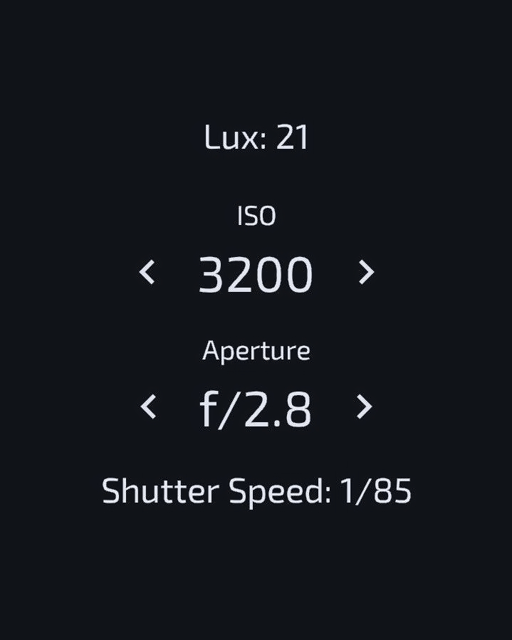

# Light Meter

  

## Overview

`lightmeter` is an Android application that uses the device's light
sensor to calculate optimal camera settings for exposure. The app allows users
to adjust ISO and aperture settings and calculates the corresponding shutter
speed to achieve proper exposure.

## Installation

See releases page

## Usage

1. Launch the App: Open the app on your Android device.
2. Point to the direction where you want take photo of
3. Adjust ISO and Aperture: Use the on-screen controls to adjust ISO and aperture settings.
4. View Shutter Speed: The app displays the current lux value and calculates the appropriate shutter speed based on the selected settings.

## Shutter Speed Calculation Formula

$${Shutter Speed} = \frac{ISO^2}{A^2 \times 2^{EV}}$$

Where:

- *N* = Aperture
- *L* = Lux
- *EV* = Exposure Value, calculated as:

$${EV} = {baseEV} + \frac{\ln{ISO / 100}}{\ln{2}}$$

- *baseEV*: assumed to be 0 for ISO 100 and aperture f/1.0 at lux = 1
